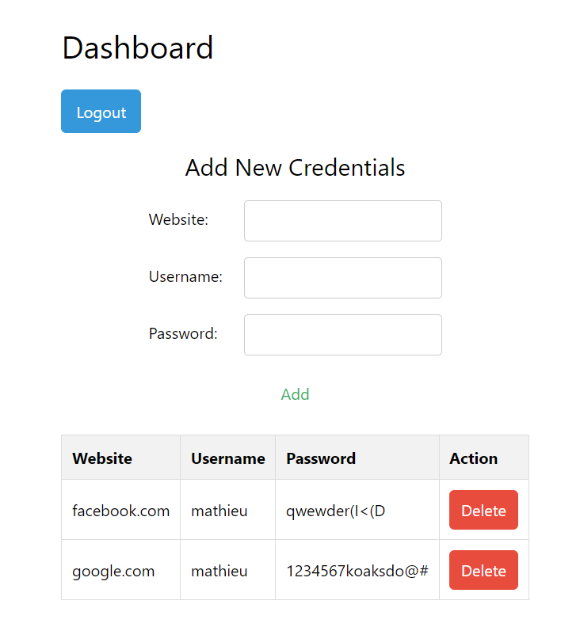
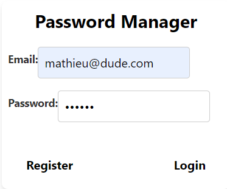

# Password Manager
Abstract
The Password Manager project provides a secure and user-friendly platform for managing and storing credentials. The application is built using React for the front end, Flask for the backend, and PostgreSQL for data storage. Users can securely register, log in, add, view, and delete credentials while maintaining data privacy.

## Introduction
In an era of increasing online activities, managing multiple credentials becomes challenging. The Password Manager addresses this issue by offering a centralized and secure solution for users to organize their usernames and passwords. The project emphasizes simplicity, security, and ease of use.

## Materials and Methods
Frontend (React):

Dashboard Interface: User-friendly dashboard for managing credentials.
API Calls with Axios: Interaction with the Flask backend through secure API calls.
React Router: Seamless navigation between components.

Backend (Flask):
User Authentication: Secure registration and login functionality.
CRUD Operations: Currently, create, read and delete operations are available (would have to implement a system to add a new credential and delete the old one to implement editing)
Password Encryption: Utilizes Flask-SQLAlchemy for database interactions and ensures password security using hash functions.
Database (PostgreSQL)

Data Storage: Persistent storage of user credentials.
Relational Database: Utilizes PostgreSQL to establish relationships between users and their credentials.
Discussion
The Password Manager project focuses on providing a reliable and secure solution for users to manage their credentials. The integration of React and Flask ensures a smooth and responsive user experience, while PostgreSQL guarantees robust and efficient data storage. The project also emphasizes the importance of security measures to protect user information.

## Potential Issues
Security Concerns: Constant vigilance is required to address any potential vulnerabilities and ensure data security.
User Experience: Regular feedback and user testing are crucial to enhancing the user interface and experience.
Scalability: As the user base grows, scalability considerations need to be taken into account for optimal performance.
Closing Thoughts
The Password Manager project aims to simplify the complexities of credential management, providing users with a secure and user-friendly solution. The combination of React, Flask, and PostgreSQL offers a robust foundation for future enhancements and scalability. This project serves as a practical and valuable tool for individuals seeking an efficient way to organize and secure their online credentials.

## Usage Instructions
Insert your PostgreSQL connection URI into Server/server.py.
Run Flask Backend: Execute the Flask backend script (server.py).
Run React App: Start the React app using npm start.

Dashboard Features:
Register and log in securely.
Add, view, and delete credentials.
Maintain data privacy with encrypted passwords or choose to store in plain text.
Log out securely from the dashboard.

## Authors:
Mathieu Poirier and David Shabo 

## Acknowledgments
We appreciate the contributions of the open-source community and various libraries that facilitated the development of this Password Manager project.
